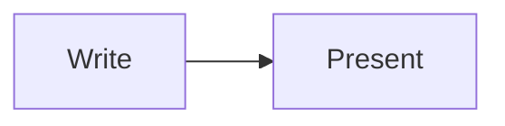

# Welcome to Markdown Slidedeck

A minimal, distraction-free presentation tool.
Write slides in plain Markdown — no plugins, no accounts, no internet required.

**Navigate:** `→` next section · `↓` sub-slide · `Space` next slide

-- duration: 30s
Everything stays local in your browser. Nothing is uploaded anywhere.

---

## Getting Started

1. Click **Choose delimiters** to confirm how your slides are separated
2. Load your Markdown — either **Import MD file** (local) or **Load from URL** (remote)
3. Navigate with the **arrow keys** or the on-screen controls

That's it. Your presentation is ready.

Loaded from a URL? Press `R` at any time to pull the latest version of that file.

-- duration: 45s
The app parses your Markdown file entirely in the browser using the marked.js library.

---

## Load from URL

Click **Load from URL** in the start screen to fetch a Markdown file directly from the web.

Paste any public `https://` address into the input and click **Load** (or press `Enter`):

- Raw GitHub files: `https://raw.githubusercontent.com/user/repo/main/slides.md`
- GitHub Gists: `https://gist.githubusercontent.com/...`
- Any publicly accessible `.md` file

The file is fetched in your browser. The server must allow cross-origin requests (CORS).
Press `Esc` or click **✕** to dismiss without loading.

-- duration: 45s
Raw GitHub URLs always support CORS. If you get a network error from another host, check that the server sends an Access-Control-Allow-Origin header.

---

## Reload from URL

Once a deck has been loaded from a URL, a **refresh** button appears at the top of the button rail (bottom right). Click it — or press `R` — to fetch the same URL again.

Use it after editing the online file: the new version replaces the old one **without retyping the URL**, and you stay on the slide you were showing.

- The fetch bypasses the browser cache, so you always get the latest version
- The URL is remembered between sessions — after reopening the app, **Reload last URL** appears on the start screen
- With a playlist loaded, the button reloads the deck currently on screen and leaves the other decks untouched

-- duration: 45s
The button turns green for a moment when the reload succeeds, red if it fails. On failure the Load from URL panel reopens with the error message so you can correct the address.

---

## Obsidian Publish

Paste any `https://publish.obsidian.md/` URL into **Load from URL** to load a slide deck hosted on your Obsidian Publish site.

The app resolves the raw Markdown file automatically using the Obsidian Publish CDN.

-- duration: 20s
No raw CDN URL needed — the app fetches the site UID from the Obsidian Publish page and constructs the direct file URL automatically.

---

## Playlist

Click **Playlist** on the start screen to pre-load several slide decks at once and switch between them instantly during a presentation.

**From URL** — paste the URL of an Obsidian Publish page whose content links to your slide decks. The app reads `[[wiki links]]`, `[markdown links](path)`, and full `https://` URLs from that page and pre-fetches every deck in parallel.

Prefix any link with `- [ ]` to exclude it from the playlist without deleting it:

```
- [[Deck A]]          ← included
- [ ] [[Deck B]]      ← skipped
- [x] [[Deck C]]      ← included
```

**Manual** — paste one slide deck URL per line.

Click **Pre-load All** to begin loading.

-- duration: 45s
The From URL mode resolves Obsidian wiki links vault-wide using the Obsidian Publish file cache — links always point to the correct file regardless of where it lives in your vault.
Only URLs from the same Obsidian Publish site are included as decks; external links on the page are ignored.

---

## Switching Decks

Once a playlist is loaded, a **deck picker overlay** shows each deck as a card:

- ⏳ loading in the background
- ✓ ready to present — click to switch instantly
- ✗ failed to load

**Click** any ✓ card, or press its **number key** (`1`–`9`), to jump to that deck.

**Reopen** the picker at any time with `D` or the **queue_play_next** button in the right toolbar.

**Close** with `D` or `Esc`.

-- duration: 30s
Switching decks resets to the first slide of the selected deck. The D shortcut and the toolbar button are only active after a playlist has been loaded.

---

# Writing Slides

Everything you need to structure your Markdown file as a slide deck.

-- duration: 15s
This section covers delimiters, speaker notes, timing, and frontmatter.

---

## Slide Delimiters

Slides are separated by a delimiter on its own line.

The default delimiter is `---`:

```
Slide one content

---

Slide two content
```

Other options: `===`, a custom string, or **# H1** mode where each top-level heading starts a new slide.
Change the delimiter anytime via the **Choose delimiters** panel.

-- duration: 1m
The delimiter must be on its own line with no surrounding text.
In H1 mode, the heading text becomes the slide title and the delimiter is implicit.

---

## Speaker Notes

Add speaker notes after the notes delimiter `--`:

```
Slide content visible to the audience

--
These notes are only shown in the notes panel.
They can span multiple lines.
```

Alternatively, use `notes:` as the notes delimiter. Both options are available in the **Choose delimiters** panel.

Notes are hidden from the main slide view and only visible in the speaker notes area.

-- duration: 45s
Speaker notes support full Markdown formatting — bullet points, bold, code, etc.

---

## Slide Timing

Add a duration hint directly on the notes delimiter line:

- `-- duration: 2m` — minutes
- `-- duration: 90s` — seconds
- `-- duration: 1m30s` — minutes and seconds combined
- `-- duration: 2:00` — colon notation also works

Once durations are set, toggle the **per-slide progress bar** with the hourglass button, and the **global session timer** with the timer button. Both are in the bottom toolbar.

-- duration: 1m
Durations are optional — you can add them to some slides and leave others without.
The global bar only appears when at least one slide has a duration set.

---

## Hidden Slides

Add `<!-- skip -->` anywhere in a slide to omit it during presentation:

```
## Optional detour
<!-- skip -->

This slide stays in the file but is not presented.
```

- The marker works on **any** slide — with a heading, with a deep heading, or with no heading at all
- On a slide that **opens a section** (the one carrying the `# H1`), it omits the whole section, sub-slides included
- On any other slide, it omits that slide alone
- It can sit on its own line or at the end of a line, e.g. `## Optional detour <!-- skip -->`
- It is stripped before rendering, so it never shows on screen, in search, or in the exported HTML
- It is an ordinary HTML comment: Obsidian, GitHub, and every other Markdown renderer ignore it, so the file stays clean elsewhere
- A marker inside a fenced code block or inline code — like `` `<!-- skip -->` `` — is left alone, so you can document it

Omitted slides are skipped during navigation and drop out of the **Total** duration bar, but they stay listed in the **Plan** outline, greyed out with an unchecked box. Tick it to bring the slide back for the current session — the Markdown file is untouched.

### The older ` --` marker

Appending ` --` to a heading still works and behaves the same way:

```
# Hidden section --

## Hidden sub-slide --
```

It only applies to headings — `<!-- skip -->` is the general form.

-- duration: 30s
Omitted slides are useful for optional content, backup slides, or slides prepared but not shown by default. Toggle them back on from the Plan panel at any time.

---

## Frontmatter

Add YAML frontmatter at the very top of your Markdown file to set metadata:

```
---
title: My Presentation
author: Jane Smith
date: 2026-01-01
---

## First Slide
```

Frontmatter is parsed and stored but does not appear as slide content.

-- duration: 20s
The frontmatter block must start on the very first line and be closed by a second --- before any slide content.

---

# Navigating

Move through your deck efficiently — with keyboard shortcuts, the overview, and the route map.

-- duration: 15s
This section covers navigation keys, the slide overview, the route map, and search.

---

## Navigation

| Action | Key or control |
|---|---|
| Move to next section | `→` |
| Move to previous section | `←` |
| Move to sub-slide below | `↓` |
| Move to sub-slide above | `↑` |
| Next slide (linear) | `Space` `Page Down` |
| Previous slide (linear) | `Page Up` |
| Toggle nav arrows | **⇄** button |

Slides starting with an `# H1` heading each form a **section** (column). Slides within a section are sub-slides (rows). The vertical dot strip on the right edge tracks your position within a section.

-- duration: 45s
Keyboard navigation is the fastest way to move through slides during a presentation.
The vertical nav strip only appears when the current section has more than one sub-slide.

---

## Slide Overview

Press `O` or click the **grid_view** button to open the slide overview.

- All slides are shown as thumbnail cards, grouped by section
- The active slide is highlighted
- Click any card to jump directly to that slide
- Press `O` or `Esc` to close

-- duration: 30s
The overview is the quickest way to jump to any slide at a glance, especially in long presentations.

---

## Route Map

Press `Alt M` to toggle the **route map** — a compact track of all slides along the bottom.

- Each dot represents one slide; section boundaries are marked with a tick
- The current slide is highlighted with a pulsing dot
- Click any dot to jump directly to that slide
- Dots with a duration show a small timer badge
- Slides with a title show a short label below the dot

-- duration: 30s
The route map is especially useful in long presentations to keep track of where you are.

---

## Search

Press `Ctrl F` (or `Cmd F` on Mac) to open the search bar.

- Type to highlight matching text across all slides
- Use `↑` `↓` to jump between matches
- The slide view navigates automatically to each match

Press `Esc` or click **✕** to close the search bar.

-- duration: 30s
Search is case-insensitive and works across slide content only — not speaker notes.

---

# Interface

Customise how the app looks and behaves during your presentation.

-- duration: 15s
This section covers fullscreen, zoom, the outline, appearance settings, and the user guide.

---

## Fullscreen

Press `F` or click the **fullscreen** button (bottom right) to enter fullscreen mode.

Press `F` again (or `Esc` from fullscreen) to exit.

Fullscreen hides the browser chrome for a distraction-free presentation experience.

-- duration: 15s
Fullscreen is supported in all modern browsers. On some systems, the first use prompts for permission.

---

## Zoom

Click the **zoom_in** button to open the zoom panel.

- Use **–** and **+** to step the content scale from 80% to 150%
- Click **100%** to reset to the default size
- The current zoom level is shown in the panel

Zoom is saved automatically alongside your other settings.

-- duration: 20s
Zoom scales the slide content without affecting the layout or overflow behaviour.

---

## Plan / Outline

Click the **toc** (table of contents) button to open the Plan panel.

The panel lists all slides that have an `# H1` heading. Click any entry to jump directly to that section.

-- duration: 20s
The outline is built automatically from H1 headings. It updates as you navigate.

---

## Appearance Settings

Click the **tune** button (bottom right) to open the settings panel.

**Background** — choose from 6 soft colour palettes:
Cloud · Warm · Sage · Slate · Lavender · Dusk

**Font** — choose from 4 system typefaces:
Sans-serif · Serif · Rounded · Monospace

Click **Reset to defaults** to restore the original appearance.
Settings are saved automatically and restored on your next visit.

-- duration: 45s
All settings are stored in your browser's localStorage — they persist across reloads but are local to your machine.

---

## User Guide

Click the **help** (**?**) button on the right toolbar to open this guide in a new browser tab.

The button is visible on the start screen — before any deck is loaded.

-- duration: 15s
The guide opens at jourde.github.io/markdown-slidedeck/how-to-use.html.

---

# Editing

Author your deck inside the app using the built-in editor.

-- duration: 15s
This section covers the split-view editor.

---

## Split-View Editor

Click the **vertical_split** button to open the built-in Markdown editor alongside the slide preview.

- Edit the Markdown source directly in the left panel
- The slide preview updates automatically as you type
- Click **Download .md** in the editor header to save the current source as a file

The split editor is useful for authoring and refining slides without switching applications.

-- duration: 30s
The editor shows the raw Markdown for the entire deck, not just the current slide.

---

# Markdown Features

What you can put inside a slide — beyond basic text.

-- duration: 15s
This section covers the full range of content types supported in slides.

---

## Markdown Support

Full **CommonMark** Markdown is supported:

- Headings (`#` `##` `###`)
- **Bold**, *italic*, ~~strikethrough~~, `inline code`
- Ordered and unordered lists
- Blockquotes, tables, horizontal rules
- Fenced code blocks with syntax hints
- Images — automatically constrained to fit the slide
- Footnotes[^1]

[^1]: Footnote definitions are placed at the bottom of a slide's content.

-- duration: 45s
Images are scaled to a maximum of 100% width and 65% viewport height, preserving aspect ratio. No manual sizing needed.

---

## Code Blocks

Fenced code blocks render with a clean monospace style:

```javascript
function greet(name) {
  return `Hello, ${name}!`;
}
```

```python
def greet(name):
    return f"Hello, {name}!"
```

Language hints after the opening ` ``` ` are supported. Use ` ```mermaid ` for diagrams.

-- duration: 30s
Code blocks scroll horizontally if the content is wider than the slide.

---

## Mermaid Diagrams

Use a fenced code block with the `mermaid` language hint to render diagrams:

````

````

Flowcharts, sequence diagrams, Gantt charts, and all other Mermaid diagram types are supported.

-- duration: 30s
Mermaid diagrams are rendered entirely in the browser — no server required.

---

## Math (KaTeX)

Write LaTeX-style math inline with `$...$` or as a display block with `$$...$$`:

Inline: $E = mc^2$

Display:

$$\int_0^\infty e^{-x^2} dx = \frac{\sqrt{\pi}}{2}$$

-- duration: 30s
Math is rendered by KaTeX, a fast client-side LaTeX engine. Standard LaTeX math syntax is supported.

---

## Callouts

Use Obsidian-style callout syntax to create styled alert boxes:

```
> [!note]
> This is a note callout.

> [!tip] Custom title
> A tip with a custom title.

> [!warning]
> Something to watch out for.
```

Available types: `note` · `tip` · `info` · `success` · `warning` · `danger` · `question` · `example` · `quote`

Add `-` after the type (e.g. `[!note]-`) to start the callout collapsed.

-- duration: 45s
Callout type names match Obsidian conventions. Many aliases are also supported (e.g. hint, caution, bug).

---

## QR Codes

Generate QR codes directly in a slide using either syntax:

**Image syntax** (alt text starts with `qr`):
```

```

**Div syntax** (for more control):
```html
<div data-qr="https://example.com" data-size="200"></div>
```

The QR code is rendered in the browser using the qrcodejs library.

-- duration: 30s
The data-size attribute controls the pixel dimensions. Default is 200 × 200 px.

---

# Reference

A quick reference for examples, shortcuts, and tips.

-- duration: 15s
This section has a complete slide example, a keyboard shortcut table, and practical tips.

---

## A Complete Slide Example

Here is a full slide with all elements combined:

```markdown
## My Slide Title

Some **bold** and *italic* text.

- Point one
- Point two

---  ← slide delimiter

-- duration: 1m30s  ← notes delimiter + duration
Speaker notes go here.
```

-- duration: 1m
The delimiter line must contain only the delimiter characters — no spaces before or after on the same line.

---

## Prompt Template for GenAI

Paste this into any AI assistant, fill in the bracketed parts, and it will return Markdown that respects this app's slide format:

````
You are creating a slide deck in Markdown for the "Markdown Slidedeck" app.
Produce the deck as plain Markdown and follow these formatting rules exactly.

TOPIC: [what the deck is about]
AUDIENCE: [who it is for]
LENGTH: [approximate number of slides]
TONE: [e.g. formal, conversational]

FORMATTING RULES
1. Separate every slide with a line containing only `---` (three hyphens),
   with a blank line before and after it. No spaces on the delimiter line.
2. Start each major section with an `# H1` heading (these become columns).
   Use `## H2` headings for the slides within a section.
3. One idea per slide. Keep on-slide text short: a heading plus a few bullets
   or a brief paragraph. Put detail in the speaker notes, not on the slide.
4. After each slide's content, add speaker notes. Put the delimiter `--` on
   its own line, then write the note text on the following line(s). Never put
   note text on the same line as the delimiter. Notes are hidden from the audience.
5. You may add a timing hint on the delimiter line, e.g. `-- duration: 1m30s`
   (also accepts `90s`, `2m`, or `2:00`). The note text still goes on the next
   line, not after the duration:
      Correct:
      -- duration: 40s
      Talking points go here.
      Wrong:
      -- duration: 40s Talking points go here.
6. Optionally begin the file with YAML frontmatter (title, author, date)
   enclosed between two `---` lines, before the first slide.
7. Content may use standard CommonMark: bold, italic, lists, tables,
   blockquotes, fenced code blocks, images, and footnotes.
8. Optional extras: Mermaid diagrams (fenced code block tagged `mermaid`),
   maths (`$...$` inline or `$$...$$` display), and callouts
   (`> [!note]`, `> [!tip]`, `> [!warning]`, etc.).
9. To omit an optional slide, put `<!-- skip -->` on a line of its own inside
   that slide. On the slide carrying a section's `# H1`, this omits the whole
   section.

Return only the Markdown, beginning with the frontmatter or the first heading.
````

-- duration: 1m
The template mirrors the delimiter, speaker-note, timing, frontmatter, and hidden-slide rules from the Writing Slides section. If you use a non-default delimiter (for example `===` or H1 mode), edit rule 1 to match before pasting.

---

## Keyboard Reference

| Action | Shortcut |
|---|---|
| Next / Previous section | `→` / `←` |
| Sub-slide below / above | `↓` / `↑` |
| Next (linear) | `Space` `Page Down` |
| Previous (linear) | `Page Up` |
| Slide overview | `O` |
| Deck picker (playlist) | `D` |
| Jump to deck N | `1`–`9` (in deck picker) |
| Route map | `Alt M` |
| Search | `Ctrl F` / `Cmd F` |
| Fullscreen | `F` |
| Reload from URL | `R` |
| Close any panel | `Esc` |

-- duration: 30s
All keyboard shortcuts work when focus is on the slide — not when a text input is active.

---

## Tips

- Keep slides **focused** — one idea per slide works best
- Use `---` on its own line; extra spaces will break detection
- Speaker notes are a great place for **talking points** and **statistics**
- The `# H1` delimiter mode works well for existing Markdown documents and creates sections automatically
- Imported files stay **local** — nothing is uploaded; URL-loaded files are fetched directly from their host
- Edited the online file mid-session? Press `R` to pull the new version without leaving your slide
- The **split editor** lets you author and preview at the same time — click **Download .md** to save your work
- Use `O` during a presentation to jump to any slide instantly
- Use **Playlist** before a multi-deck session — all decks pre-load in the background; switching between them is instant with `D` or number keys
- Point **Playlist → From URL** at an Obsidian Publish plan page containing `[[wiki links]]` to your slide decks; the app resolves all links vault-wide automatically

-- duration: 1m
You can re-import a file at any time — the app will reload from the beginning.

---

## Ready to Present

Load your own Markdown file and start presenting.

*Write in Markdown. Present anywhere.*

-- duration: 15s
This slide deck was itself written in Markdown and presented using this app.
